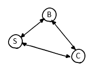

# Uniformed and Informed Search

## Search Problem
A solution sequence of actions

1. State space: Smallest variable sequence set
2. Inital States
3. Goal States
4. Successor Function: Validate functtion
5. Cost

### State Space Graph

