# Uniformed and Informed Search

## Search Problem

A solution sequence of actions

1. State space: Smallest variable sequence set
2. Inital States
3. Goal States
4. Successor Function: Validate functtion
5. Cost

### State Space Graph

Structure: Directional Graph

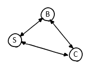

### Search Tree

Structure: Binary Tree

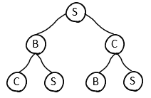

### Tree Search

```typescript
interface Tree {
    value: any;
    left? Tree;
    right? Tree;
}
function treeSearch(root, goal) {
    // if the frontier is empty then return failure
    if(root.left == null || root.right == null) {
        return null;
    }

    // if the node contains a goal state then return the corresponding solution
    if(root.value == goal) {
        return root;
    }
    // else expand the node and add the resulting nodes to the frontier
    else {
        return treeSearch(root.left, goal) || treeSearch(root.right, goal);
    }

}
```

### General Tree Search

```typescript
interface GeneralTree {
  value: any;
  nodes: GeneralTree[];
}
function graphSearch(root, goal) {
  // if the frontier is empty then return failure
  if (root.nodes.length == 0) {
    return null;
  }

  // if the node contains a goal state then return the corresponding solution
  if (root.value == goal) {
    return root;
  }
  // else add the node to the explored set, expand the node and add the resulting nodes to the frontier only if not in the frontier or explored set
  else {
    explored = [];
    root.nodes.forEach((n) => {
      if (graphSearch(n, goal)) {
        explored.add(graphSearch(n, goal));
      }
    });
  }
}
```

### Conclusion

**Evaluation**

1. Completeness
2. Optimality
3. Time Complexity
4. Spaxe complexity

**Measuring Complexity**

1. b: max branching factor (finite)
2. d: depth of the goal node with the least cost (finite)
3. m: max depth of path length (potentially infinite)

## Uniformed Search

### Breadth-First Search

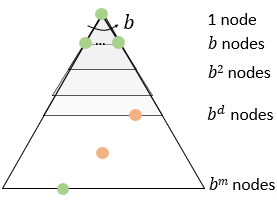

- Completeness: Yes if b is finite
- Optimality: Only of the cost are all 1
- Time Complexity: ~O(<sup>d</sup>)
- Space Complexity: ~O(b<sup>d</sup>)

### Uniform Cost Search

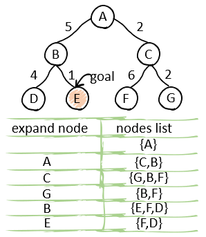

- Key Idea: Expand cheapest unexpanded node
- Immplementation: Priority queue (ordered by path cost descending)

Step 1: Add A in queue

Step 2: Expand node A

Step 3: Add B and C into the queue

Step 4: Order the queue by cost

...

- Completeness: Yes if step cost >= 𝜖 (𝜖 > 0) & best solution has finite cost

- Optimality: Yes
- Time Complexity: O(b<sup>(1+C/𝜖)</sup>), wheh C is the cost of the optimal solution
- Space Complexity: O(b<sup>(1+C/𝜖)</sup>)

## Depth-First Search

- Key Idea: Expand deepest unexpanded node
- Implementation: LIFO (Last In First Out) -> Stack

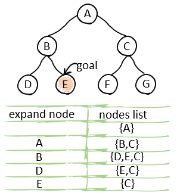

- Completeness: No, as infinite-depth spaces or spaces with loops
- Optimality: No
- Time Complexity: O(b<sup>m</sup>)
- Space complexity: O(bm)

# Supervised Learning

- Goal: Learn an unknown target function
- Input: Training Set (Xi, yi), yi = _f_(Xi). Xi = features
- Output: Hypothesis _h_ -> close to _f_, ie _h_ predicts unseen example ("test set")

## Possible Hypothesis

1. Linear models
2. Logistic Regression
3. Neural Network
4. Decision Trees

## What to Learn

### Classification

Discreate the target function

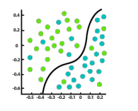

Tool: Support Vector Machine (SVM)

### Regression

Continuous the target function

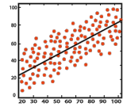

Training set: x -> _f_(x)

Testing set: use _f_(x) in Training set to find y

## Supervised Lerning Pipeline

1. Preparing Data (Training Set)
2. Determine the hypothesis space _H_
3. Determine degree of fit measure
4. 1+2+3: Learn a good _h_
5. Evaluating _h_ (Testing set)

## Regression Model: Polynomial Fitting

1. Hypothesis Space: Polynomials of degree M

   - H = { w | h(x, w) = w<sub>0</sub> + w<sub>1</sub>x + w<sub>2</sub>x<sup>2</sup> + ... + w<sub>m</sub>x<sup>m</sup> }

2. Degree of Fit/Evaluation: Sum of squared loss
   - E(w) = 1/2 N∑n=1 (h(X<sub>n</sub>, W) - y<sub>n</sub>)<sup>2</sup>
3. Find a good h

## Under-fitting and Overfitting

### Under-fitting

high error, low complexity

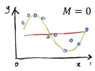

### Overfitting

low error, high complexity

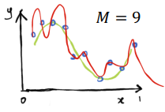

### Preventing Overfitting: Regularization

#### Ridge Regression

Adding a _l<sub>2</sub>_ regularization term

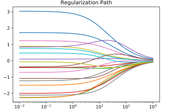

- E(w) = 1/2 N∑n=1 (h(X<sub>n</sub>, W) - y<sub>n</sub>)<sup>2</sup> + λ/2 ||w||<sup>2</sup>
  - ||w||<sup>2</sup> = w<sub>0</sub><sup>2</sup> + w<sub>1</sub><sup>2</sup> + ... + w<sub>M</sub><sup>2</sup>

#### Lasso Regression

Adding a _l<sub>1</sup>_ regularization term

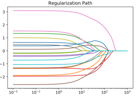

- E(w) = 1/2 N∑n=1 (h(X<sub>n</sub>, W) - y<sub>n</sub>)<sup>2</sup> + λ/2 |w|<sup>1</sup>
  - |w|<sup>1</sup> = w<sub>0</sub> + w<sub>1</sub> + ... + w<sub>M</sub>

### Classification Model: Decision Tree

Hypothesis space: a decision tree

- H = { DT| h(x, DT) = DT(x)}

#### Entropy

Measure how information of the node

- Smaller entropy have more informative
- Formula: _I_(n) = -(n)log<sub>2</sub>(n)
- Select largest Gain(x, y)

#### Step 1

Find label entropy

> _H_(label) = -(n<sub>1</sub>)log<sub>2</sub>(n<sub>1</sub>) + -(n<sub>2</sub>)log<sub>2</sub>(n<sub>2</sub>)

#### Step 2

Find value of feature<sub>a</sub> in options <sub>i, ii</sub>

> a: P(a<sub>i</sub>), P(a<sub>ii</sub>)

#### Step 3

Find child feature<sub>a</sub> of option<sub>i</sub> entropy

> _H_(a<sub>i</sub>) = -(n<sub>1</sub>)log<sub>2</sub>(n<sub>1</sub>) + -(n<sub>2</sub>)log<sub>2</sub>(n<sub>2</sub>)

#### Step 4

Find child feature<sub>a</sub> of option<sub>ii</sub> entropy

> _H_(a<sub>ii</sub>) = -(n<sub>1</sub>)log<sub>2</sub>(n<sub>1</sub>) + -(n<sub>2</sub>)log<sub>2</sub>(n<sub>2</sub>)

#### Step 5

Find the sum of feature<sub>a</sub>

> _E_(a, n<sub>1</sub>) = P(a<sub>i</sub>)_H_(a<sub>i</sub>) + P(a<sub>ii</sub>)_H_(a<sub>ii</sub>)

#### Step 6

Find Gain of feature<sub>a</sub>

> Gain(label, n<sub>1</sub>) = _H_(label) - _E_(a, n<sub>1</sub>)

#### Step 7

Repeat Step 2-6

#### Step 8

Find the maximum Gain(label, n<sub>x</sub>)

#### Step 9

Draw the decision tree

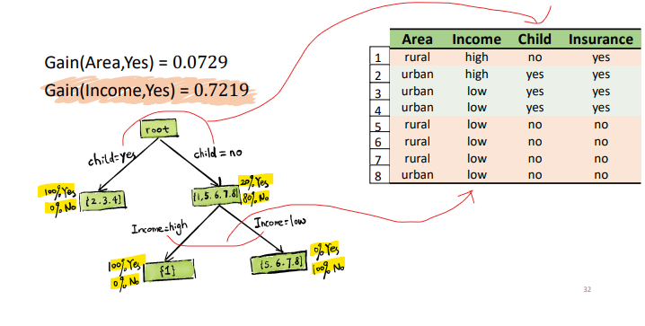

Highlight value come from Entropy calculation
